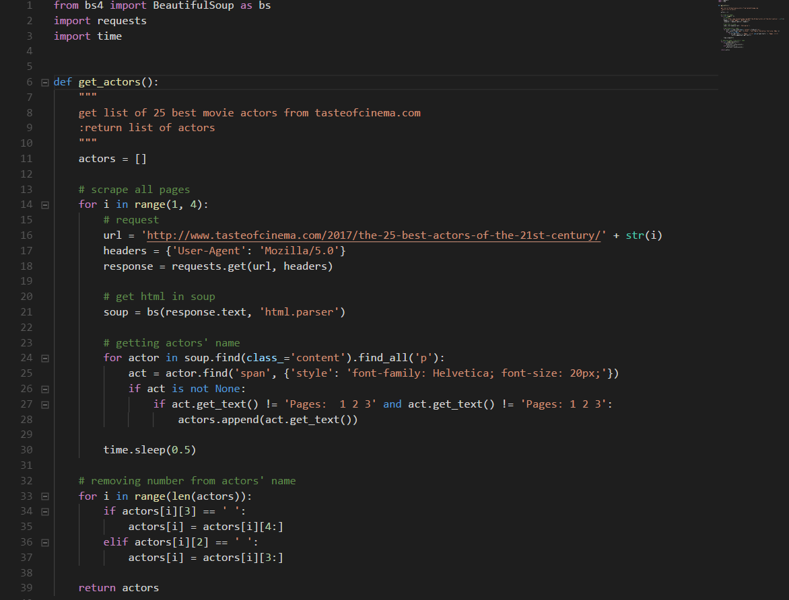

# Scraping Data Film dari Aktor-Aktor Terbaik

## Description

Program akan melakukan scraping dari website:
```
- http://www.tasteofcinema.com/2017/the-25-best-actors-of-the-21st-century/
- http://www.rottentomatoes.com/
```
dan menyimpannya dalam sebuah file .json

## Specifications

1. Lakukan data scraping dari sebuah laman web untuk memeroleh data atau informasi tertentu __TANPA MENGGUNAKAN API__

2. Daftarkan judul topik yang akan dijadikan bahan data scraping pada spreadsheet berikut: [Topik Data Scraping](http://bit.ly/TopikDataScraping). Usahakan agar tidak ada peserta dengan topik yang sama. Akses edit ke spreadsheet akan ditutup tanggal 10 Mei 2018 pukul 20.00 WIB

3. Dalam mengerjakan tugas 1, calon warga basdat terlebih dahulu melakukan fork project github pada link berikut: https://github.com/wargabasdat/Seleksi-2018/tree/master/Tugas1. Sebelum batas waktu pengumpulan berakhir, calon warga basdat harus sudah melakukan pull request dengan nama ```TUGAS_SELEKSI_1_[NIM]```

4. Pada repository tersebut, calon warga basdat harus mengumpulkan file script dan json hasil data scraping. Repository terdiri dari folder src dan data dimana folder src berisi file script/kode yang __WELL DOCUMENTED dan CLEAN CODE__ sedangkan folder data berisi file json hasil scraper.

5. Peserta juga diminta untuk membuat Makefile sesuai template yang disediakan, sehingga program dengan gampang di-_build_, di-_run_, dan di-_clean_

``` Makefile
all: clean build run

clean: # remove data and binary folder

build: # compile to binary (if you use interpreter, then do not implement it)

run: # run your binary

```

6. Deadline pengumpulan tugas adalah __15 Mei 2018 Pukul 23.59__

7. Tugas 1 akan didemokan oleh masing-masing calon warga basdat

8. Demo tugas mencakup keseluruhan proses data scraping hingga memeroleh data sesuai dengan yang dikumpulkan pada Tugas 1

9. Hasil data scraping ini nantinya akan digunakan sebagai bahan tugas analisis dan visualisasi data

10. Sebagai referensi untuk mengenal data scraping, asisten menyediakan dokumen "Short Guidance To Data Scraping" yang dapat diakses pada link berikut: [Data Scraping Guidance](http://bit.ly/DataScrapingGuidance)

11. Tambahkan juga gitignore pada file atau folder yang tidak perlu di upload, __NB : BINARY TIDAK DIUPLOAD__

12. JSON harus dinormalisasi dan harus di-_preprocessing_
```
Preprocessing contohnya :
- Cleaning
- Parsing
- Transformation
- dan lainnya
```

13. Berikan README yang __WELL DOCUMENTED__ dengan cara __override__ file README.md ini. README harus memuat minimal konten :
```
- Description
- Specification
- How to use
- JSON Structure
- Screenshot program (di-upload pada folder screenshots, di-upload file image nya, dan ditampilkan di dalam README)
- Reference (Library used, etc)
- Author
```

<h1 align="center">
  <br>
  Selamat BerEksplorasi!
  <br>
  <br>
</h1>

<p align="center">
  <br>
  Basdat Industries - Lab Basdat 2018
  <br>
  <br>
</p>

## How To Use

1. Jalankan Makefile 
2. Tunggu sampai proses scraping selesai
3. Hasil scraping akan disimpan di file dengan nama "data.json" pada folder data

## JSON Structure

JSON berupa list dari dictionary. Dictionary berisi list of actor yang berisi:
```
{
  'actor': <nama aktor>,
  'movies': <list of movies yang berisi:
            {
              'title': <judul film>,
              'rating': <rating film>,
              'year': <tahun rilis film>,
              'genre': <list of genre film>,
              'director': <sutradara dari film>,
              'studio': <studio pembuatan film>
            }
            >
}
```

## Screenshots


## Reference
Library yang digunakan:
1. bs4 (BeautifulSoup)
2. requests
3. time
4. json

## Author
Nicholas Wijaya - 13516121
